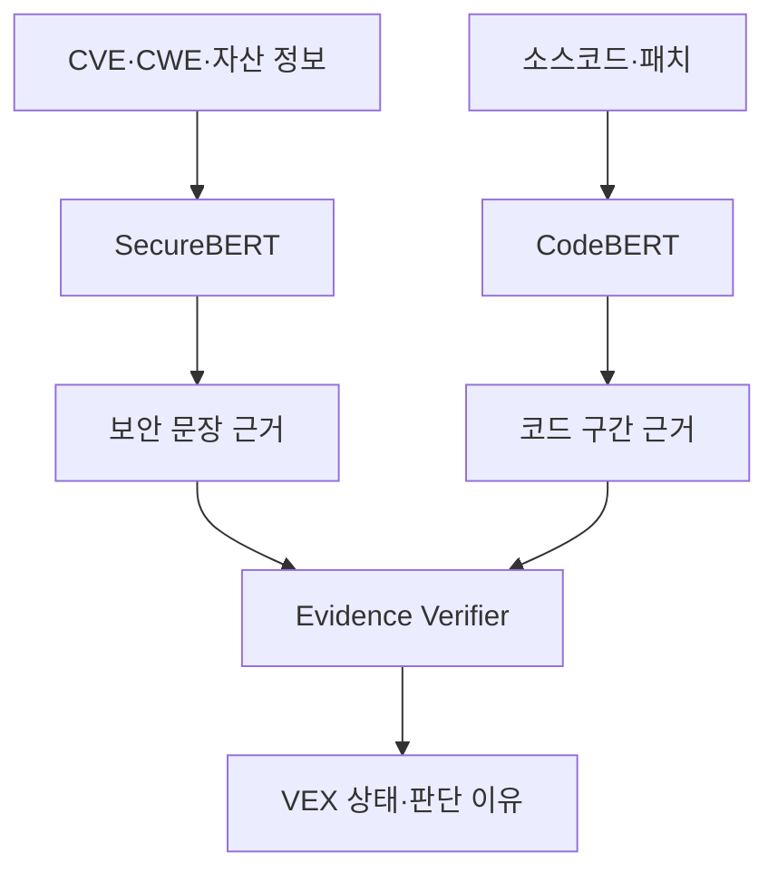

# Explainable ICS VEX with SecureBERT and CodeBERT

SecureBERT와 CodeBERT를 결합하여 산업제어시스템(ICS) 자산의 CVE 영향 여부를 판단하고, 판단에 사용된 보안 문장과 코드 구간을 함께 제시하는 증거 기반 VEX 프레임워크이다.

이 프로젝트에서 모델은 최종 판단 이유를 자유롭게 생성하지 않는다. SecureBERT와 CodeBERT가 각각 근거 후보를 추출하고, Evidence Verifier가 원본 증거와 예측 기여도를 확인한 후 보수적 결정 규칙에 따라 VEX 상태와 설명을 생성한다.

## 1. 목표

- CVE, CWE, CPE, SBOM 및 ICS 자산 정보를 이용한 영향 가능성 분석
- 소스코드, 펌웨어 추출 코드 또는 패치 diff를 이용한 취약 코드 분석
- VEX 상태와 함께 문장·함수·코드 라인 단위의 판단 근거 제공
- 증거가 부족하거나 모델 결과가 충돌하면 보수적으로 `UNDER_INVESTIGATION` 반환
- 모든 판단과 설명을 원본 증거의 `evidenceId`로 추적

## 2. VEX 상태

| 상태 | 의미 |
| --- | --- |
| `LIKELY_AFFECTED` | 영향 조건과 취약 코드 또는 실행 증거가 확인됨 |
| `LIKELY_NOT_AFFECTED` | 비영향을 뒷받침하는 적극적인 반증이 확인됨 |
| `UNDER_INVESTIGATION` | 증거 부족, 모델 간 충돌 또는 추가 검증이 필요함 |

`LIKELY_NOT_AFFECTED`는 취약 코드를 찾지 못했다는 사실만으로 결정하지 않는다. 영향 버전 범위 밖, 컴포넌트 미포함, 취약 기능 제외, 실행 경로 도달 불가 또는 패치 적용과 같은 적극적인 비영향 증거가 필요하다.

## 3. 전체 구조



### 구성요소별 역할

| 구성요소 | 역할 |
| --- | --- |
| SecureBERT | CVE 설명과 자산 정보의 의미적 관련성 및 영향 조건 분석 |
| CodeBERT | 취약 구현, 함수, API 호출 및 패치 구문의 존재 여부 분석 |
| Rationale Head | 예측에 사용된 문장·토큰·코드 라인 선택 |
| Evidence Verifier | 근거의 원본 존재 여부, 충분성, 충돌 및 예측 기여도 검증 |
| Decision Engine | 검증된 증거를 규칙에 따라 결합하여 최종 VEX 상태 결정 |
| Explanation Generator | 검증된 주장만 템플릿 또는 제한된 LLM으로 자연어화 |

## 4. 처리 흐름

1. SBOM 컴포넌트를 CPE와 매핑하고 관련 CVE/CWE 정보를 수집한다.
2. SecureBERT가 CVE 영향 조건과 자산의 버전·구성·노출 정보를 비교한다.
3. 코드 증거가 존재하면 CodeBERT가 취약 함수와 대상 코드 또는 패치 diff를 비교한다.
4. 각 모델은 분류 결과와 함께 근거 위치 및 기여 점수를 반환한다.
5. Evidence Verifier가 근거를 원본 자료와 대조하고 충분성과 포괄성을 검사한다.
6. Decision Engine이 검증된 증거와 충돌 정책을 이용해 최종 상태를 결정한다.
7. Explanation Generator가 각 주장에 `evidenceId`를 연결한 판단 이유를 생성한다.

코드에 접근할 수 없는 상용 ICS 제품에서는 CodeBERT를 필수 단계로 사용하지 않는다. 이 경우 SecureBERT 결과에 버전, 구성, 네트워크 도달 가능성, 공급업체 권고 및 재현 결과를 결합한다.

## 5. 모델 설계

각 encoder에 분류 헤드와 근거 추출 헤드를 부착하는 멀티태스크 구조를 사용한다.

```text
SecureBERT / CodeBERT Encoder
├── Classification Head  → 영향 또는 코드 상태
└── Rationale Head       → 근거 토큰·문장·코드 라인
```

전체 학습 손실은 다음과 같이 구성할 수 있다.

```text
L_total = L_classification + λ × L_rationale
```

- `L_classification`: 상태 분류 손실
- `L_rationale`: 정답 근거 구간 탐지 손실
- `λ`: 분류와 근거 추출 학습의 상대적 비중

### SecureBERT 입력 예시

```text
[CVE]
Affected versions are earlier than 3.2.
The vulnerability is reachable through the Modbus diagnostic function.

[ASSET]
Product: PLC-A
Firmware: 3.1
Modbus diagnostic function: enabled
Network exposure: reachable from engineering workstation
```

### CodeBERT 입력 예시

```text
[VULNERABILITY DESCRIPTION]
Diagnostic packet data is copied without validating its length.

[TARGET CODE]
if (function_code == DIAGNOSTIC) {
    memcpy(buffer, packet.data, packet.length);
}
```

## 6. 모델 출력 스키마

### SecureBERT 출력

```json
{
  "prediction": "LIKELY_AFFECTED",
  "confidence": 0.91,
  "rationales": [
    {
      "text": "Affected versions are earlier than 3.2",
      "evidenceId": "CVE-01",
      "score": 0.83
    },
    {
      "text": "Firmware: 3.1",
      "evidenceId": "ASSET-02",
      "score": 0.80
    },
    {
      "text": "Modbus diagnostic function: enabled",
      "evidenceId": "ASSET-03",
      "score": 0.76
    }
  ]
}
```

### CodeBERT 출력

```json
{
  "prediction": "VULNERABLE_CODE_PRESENT",
  "confidence": 0.88,
  "rationales": [
    {
      "file": "modbus_handler.c",
      "startLine": 146,
      "endLine": 148,
      "code": "memcpy(buffer, packet.data, packet.length);",
      "reasonType": "MISSING_BOUNDS_CHECK",
      "score": 0.89,
      "evidenceId": "CODE-01"
    }
  ]
}
```

### 최종 VEX 출력

```json
{
  "status": "LIKELY_AFFECTED",
  "confidence": 0.89,
  "justification": "설치된 펌웨어 3.1은 영향 범위인 3.2 미만에 해당한다. Modbus 진단 기능이 활성화되어 있으며, 대상 코드에서 길이 검증 없는 메모리 복사 연산이 확인되었다.",
  "claims": [
    {
      "claimId": "CLAIM-01",
      "claim": "The installed firmware is within the affected range.",
      "producer": "SecureBERT",
      "confidence": 0.91,
      "evidenceIds": ["CVE-01", "ASSET-02"]
    },
    {
      "claimId": "CLAIM-02",
      "claim": "The vulnerable operation is present in the target code.",
      "producer": "CodeBERT",
      "confidence": 0.88,
      "evidenceIds": ["CODE-01"]
    }
  ],
  "verification": "ACCEPTED",
  "explanationMethods": [
    "rationale_extraction",
    "integrated_gradients",
    "input_ablation"
  ]
}
```

## 7. 결정 규칙

| SecureBERT 결과 | CodeBERT 또는 실행 증거 | 최종 상태 |
| --- | --- | --- |
| 영향 조건 확인 | 취약 코드 또는 재현 성공 | `LIKELY_AFFECTED` |
| 영향 가능성 높음 | 코드 접근 불가 | `UNDER_INVESTIGATION` |
| 영향 가능성 높음 | 취약 코드 미탐지 | `UNDER_INVESTIGATION` |
| 적극적인 비영향 조건 확인 | 취약 코드 부재·경로 차단 확인 | `LIKELY_NOT_AFFECTED` |
| 두 모델 또는 증거가 충돌 | 무관 | `UNDER_INVESTIGATION` |

예측 확률은 보조 정보로 사용하며, 높은 확률만으로 VEX 상태를 확정하지 않는다. 최종 결정에는 상태별 필수 증거 조건을 적용한다.

## 8. 판단 이유 생성 원칙

최종 설명은 다음 원칙을 따라야 한다.

- 검증된 `claim`과 `evidenceId`만 사용한다.
- 모델이 원본에 없는 제품, 버전, 함수 또는 공격 경로를 추가하지 못하게 한다.
- 근거가 부족하면 설명을 보완하지 않고 `INSUFFICIENT_EVIDENCE`를 반환한다.
- 문장별로 사용한 증거를 추적할 수 있어야 한다.
- 생성형 LLM을 사용하더라도 최종 상태 결정 권한은 부여하지 않는다.

권장 템플릿:

```text
[버전 근거]에 따르면 대상 자산은 영향 버전 범위에 포함된다.
[구성 근거]에서 취약 기능의 활성화가 확인되었다.
[코드 또는 실행 근거]에서 취약 동작이 확인되었다.
따라서 [VEX 상태]로 판단하였다.
```

## 9. 설명 검증

Attention 값만으로 판단 이유를 설명하지 않는다. Attention은 시각화에는 사용할 수 있지만, 실제 예측 원인임을 보장하지 않는다.

권장 검증 방법은 다음과 같다.

### Sufficiency

선택된 근거만 입력했을 때도 원래 예측이 유지되는지 측정한다.

```text
전체 입력의 AFFECTED 확률       : 0.91
선택된 근거만 사용한 확률       : 0.86
```

### Comprehensiveness

선택된 근거를 제거했을 때 원래 예측 확률이 감소하는지 측정한다.

```text
전체 입력의 AFFECTED 확률       : 0.91
선택된 근거를 제거한 확률       : 0.42
```

### 보조 설명 기법

- Integrated Gradients: 토큰 또는 코드 토큰의 예측 기여도 산출
- SHAP: 버전 일치, 기능 활성화, 네트워크 노출 등 정형 특징의 기여도 분석
- Input Ablation: 특정 문장·함수·코드 라인을 제거한 뒤 예측 변화 측정

## 10. 학습 데이터 형식

분류 라벨뿐 아니라 사람이 확인한 근거 위치를 포함해야 한다.

```json
{
  "sampleId": "SAMPLE-001",
  "cveId": "CVE-2026-XXXX",
  "assetId": "PLC-A",
  "label": "LIKELY_AFFECTED",
  "securityRationales": [
    {
      "evidenceId": "ASSET-02",
      "text": "Firmware: 3.1"
    },
    {
      "evidenceId": "ASSET-03",
      "text": "Modbus diagnostic function: enabled"
    }
  ],
  "codeRationales": [
    {
      "evidenceId": "CODE-01",
      "file": "modbus_handler.c",
      "startLine": 146,
      "endLine": 148
    }
  ]
}
```

## 11. 평가 지표

### 상태 분류

- Macro F1
- 클래스별 Precision, Recall, F1
- Confusion Matrix
- Expected Calibration Error 또는 Brier Score
- `UNDER_INVESTIGATION` 전환율

### 근거 추출

- Token-level 또는 Span-level Precision, Recall, F1
- Intersection over Union
- Sufficiency
- Comprehensiveness
- 원본 `evidenceId` 연결 정확도

### 시스템 수준

- 잘못된 `LIKELY_NOT_AFFECTED` 비율
- 증거 충돌 탐지율
- 사람 검토 결과와의 일치도
- CVE당 처리 시간 및 추론 비용

ICS VEX에서는 전체 정확도보다 잘못된 비영향 판정의 위험이 크므로, `LIKELY_NOT_AFFECTED`의 Precision과 근거 충족률을 별도로 보고한다.

## 12. 권장 디렉터리 구조

```text
project/
├── data/
│   ├── raw/
│   ├── processed/
│   └── annotations/
├── models/
│   ├── securebert/
│   └── codebert/
├── src/
│   ├── preprocessing/
│   ├── securebert_classifier/
│   ├── codebert_analyzer/
│   ├── rationale_extraction/
│   ├── evidence_verifier/
│   ├── decision_engine/
│   └── explanation_generator/
├── schemas/
│   ├── evidence.schema.json
│   └── vex-result.schema.json
├── tests/
└── README.md
```

## 13. 구현 순서

1. RoBERTa 또는 SecureBERT 기반 CVE–자산 상태 분류 baseline을 구축한다.
2. CodeBERT 기반 취약 코드 존재 여부 분류기를 구축한다.
3. 각 모델에 rationale head를 추가하고 근거 주석 데이터로 멀티태스크 학습한다.
4. Integrated Gradients와 입력 제거 실험을 이용해 근거 충실도를 검증한다.
5. Evidence Graph와 보수적 Decision Engine을 연결한다.
6. 검증된 근거만 사용하는 템플릿형 설명 생성을 구현한다.
7. 생성형 LLM 설명은 마지막 확장 실험으로 비교한다.

## 14. 제한사항

- SecureBERT의 보안 도메인 지식만으로 실제 자산의 악용 가능성을 확정할 수 없다.
- CodeBERT는 소스코드, 디컴파일 코드 또는 의미 있는 패치 정보가 없으면 활용이 제한된다.
- 중요 토큰 점수는 인과적 증거가 아니므로 입력 제거 및 사람 검토가 필요하다.
- 코드 존재는 실행 경로 도달 가능성이나 실제 악용 가능성과 동일하지 않다.
- 제품 버전, 빌드 옵션, 네트워크 경로 및 런타임 재현 증거를 함께 검토해야 한다.

## 15. 핵심 설계 원칙

> SecureBERT는 보안·자산 문장 근거를 추출하고, CodeBERT는 함수·코드 라인 근거를 추출한다. Evidence Verifier가 근거의 일치성 및 충실도를 검사한 뒤, Decision Engine이 보수적인 규칙으로 VEX 상태를 결정한다. 자연어 설명은 검증된 증거를 표현하는 역할만 수행한다.

